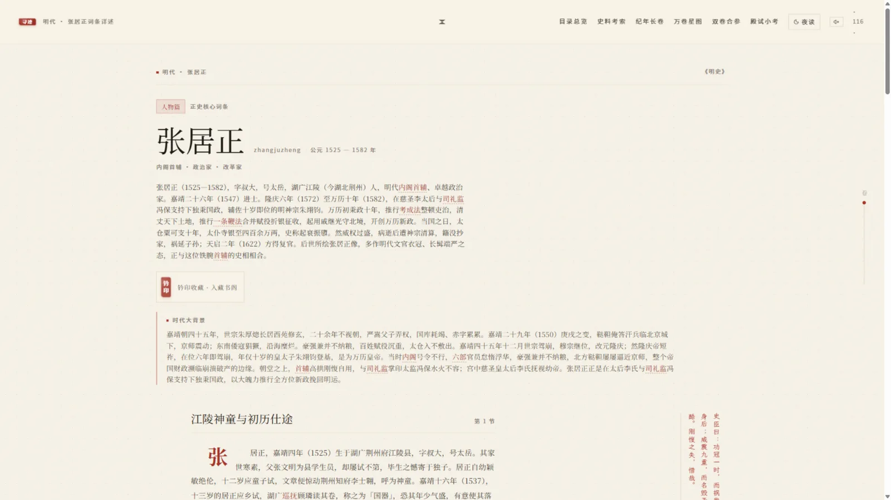
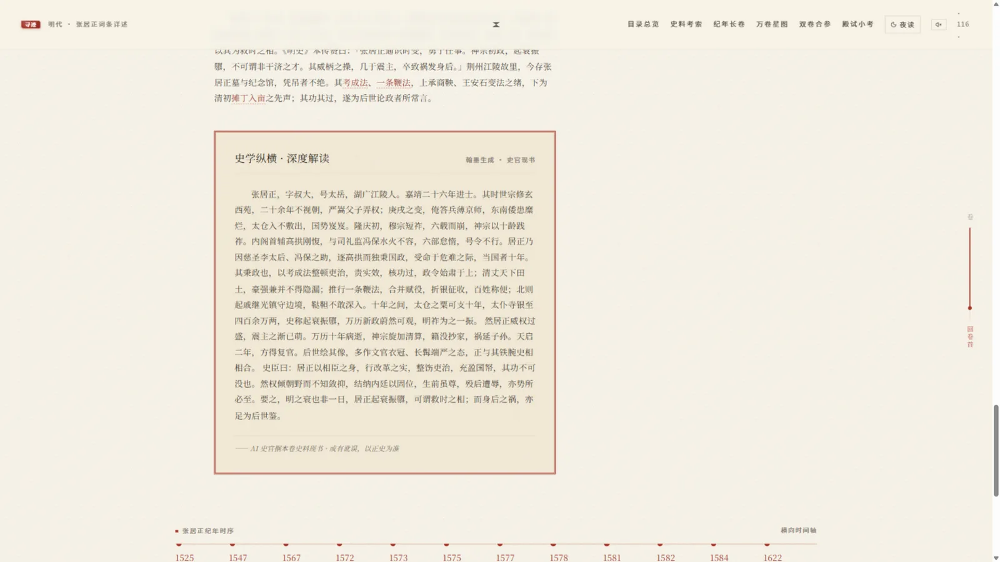
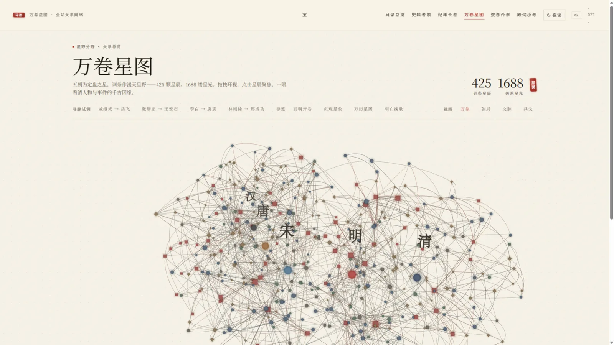
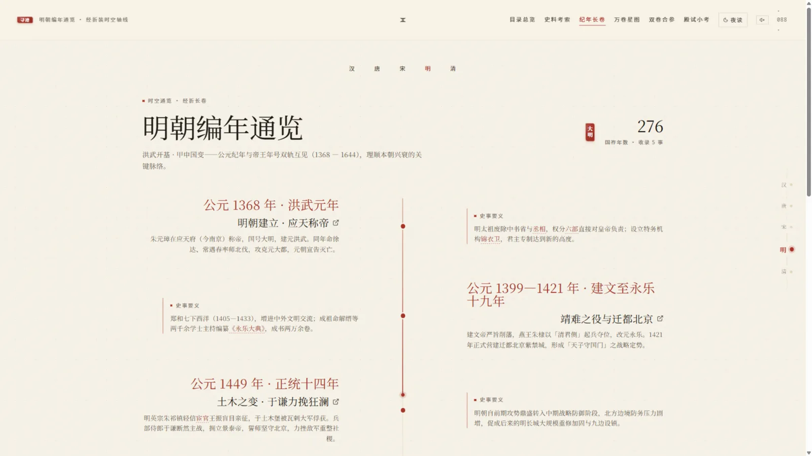
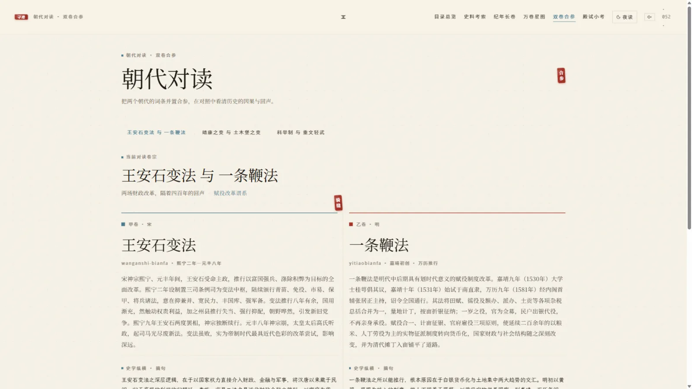

<div align="center">

# 寻迹

**纵观华夏，一部长河里的通史**

以中国传统典籍装帧的视觉语言为基调 · 宋体正文 · 朱笔圈点 · 竖排史料 —— 像翻一部会呼吸的纸墨史册。

<p>
  
</p>

</div>

---

## 这是什么

「寻迹」是一部可以走进去的中国历史知识库：一条水墨长河横贯屏幕，汉、唐、宋、明、清五座卷轴沿岸排布，点击卷轴便进入那个朝代的颜色。词条以正史为骨、配图以画传为形，检索、星图、长卷、对读、推演、殿试层层展开。

全部内容为内置静态数据，无后端、无数据库、无网络请求，打开即读。

> 汉 · 唐 · 宋 · 明 · 清 —— 五朝 425 条词条 · 168 组木刻版画配图 · 1688 条关系星光 · 约 105 万字正文

---

## 一览

<table>
<tr>
<td width="50%">

<p align="center"><b>典籍版式</b> · 竖排史料 · 史家朱批 · 夹注释义</p>
</td>
<td width="50%">

<p align="center"><b>史学纵横</b> · AI 史官现书 · 墨点逐字涌现</p>
</td>
</tr>
<tr>
<td width="50%">

<p align="center"><b>万卷星图</b> · 425 星辰 · 寻脉驿路逐站点亮</p>
</td>
<td width="50%">

<p align="center"><b>编年长卷</b> · 一朝一色 · 事件直链词条</p>
</td>
</tr>
<tr>
<td colspan="2">

<p align="center"><b>朝代对读</b> · 双词条跨朝代合参 · 骑缝落印</p>
</td>
</tr>
</table>

---

## 功能

◇ **3D 时空长河** — 拖拽环视、滚轮推近、点击卷轴进入朝代；空白处「点墨捞史」捞出一叶编年残句；按 `H` 进入沉浸模式，纯长河漫游

◇ **词条详情** — 典籍版式排印：竖排史料原文（古籍自右向左读）、史家朱批、「史学纵横」深度解读、词条纪年时序、木刻版画图版

◇ **万卷星图** — 全站关系网络：星点按类型编形、星光按关系族配色；「寻脉」用 BFS 找任意两词条的最短关系链，金色驿路逐站点亮

◇ **编年长卷** — 唐 / 宋 / 明三朝时间轴，事件与词条直连；朝代主题色随滚动平滑流转

◇ **朝代对读** — 跨朝代词条并置合参（王安石变法 × 一条鞭法、靖康之变 × 土木堡之变……），左右双栏相向合拢、中缝骑缝印落定

◇ **时空推演** — 反事实历史分叉树：实线为史实、朱色虚线为推演，全程「推演 · 非史实」朱印标注；可请 AI「再推一步」延展分叉

◇ **器物 3D 展台** — 永乐青花、大典书函、浑天仪、宝船、泥活字格等程序化低模，可 360° 拖转，夜读灯光联动

◇ **针路图** — 郑和下西洋 / 玄奘西行两幅全宽 3D 航路长卷：金色飞线、宝船与行脚僧沿线巡游

◇ **殿试三题** — 从编年长卷自动出题（确定性随机，可复现），三问四选一，答毕放榜颁功名

◇ **检索** — 汉字 / 全拼 / 拼音首字母联想直达（输入 `zjz` 即达张居正），命中词高亮

◇ **AI 史官** — 词条解读流式现书、「问典」RAG 溯源问答（答案挂站内引用卡）、84 处典章术语夹注追问、AI 页边朱批、多模态图版考据

◇ **我的寻迹** — 足迹与钤印藏书阁（localStorage 本地留存）；Canvas 合成可下载的藏书票

◇ **日读 / 夜读** — 一键切换，全站墨染入夜，「灯火朱」提亮，3D 场景同步换色

---

## 快速开始

环境要求：Node.js 18+ 与 pnpm。

```bash
pnpm install     # 安装依赖
pnpm dev         # 启动开发服务（默认 http://localhost:5173）
pnpm build       # 类型检查 + 生产构建
pnpm preview     # 预览构建产物
```

构建产物为 `dist/` 下的纯静态文件，可直接部署到任意静态托管服务。

AI 功能通过 OpenAI 兼容接口接入，配置 `.env.local`（不入库）：

```bash
VITE_LLM_BASE=https://<服务地址>/v1
VITE_LLM_KEY=<API Key>
VITE_LLM_MODEL=<主力模型>            # 长文本深度解读
VITE_LLM_FAST_MODEL=<快速档模型>     # 问答 / 批语等短文本
VITE_LLM_VISION_MODEL=<多模态模型>   # 图版鉴识
# VITE_LLM_REPLAY=1                 # 演示回放模式（预录响应，无需网络）
```

未配置密钥时，AI 入口显示「翰墨未启」占位，其余功能（检索 / 词条 / 长卷 / 星图 / 对读 / 殿试 / 针路图 / 藏书票）完全可用 —— 全站零网络依赖，断网亦可完整浏览。

---

## 仓库说明

克隆即跑，无需额外下载：全部的词条数据与图片资源（168 组木刻版画配图，WebP 格式）均已随仓库提供，`pnpm install && pnpm dev` 即可看到完整站点。生图母版 PNG（每张 3-4MB，约 630MB）仅本地保留，不随仓库分发——网站运行完全使用 WebP 版本，两者内容一致。

---

## 技术栈

**Vue 3**（Composition API）· **TypeScript** · **Vite** · **Tailwind CSS v4** · **Three.js**（自写水墨 Shader）· **Pinia** · **Vue Router** · **MiniSearch** · **pinyin-pro**

<details>
<summary>技术细节（展开）</summary>

- **零后端**：全部词条与关系数据构建期内联；检索索引内存构建；星图布局与最短路径本地计算
- **设计系统**：语义色 token 层 + 「一朝一色」主题系统（5 套朝代配色 × 日 / 夜两态）；中文优先排印体系（12/13/15/16 四档字号）
- **动效体系**：墨渗转场、盖印落纸、滚动渐显、聚字开场；全部尊重 `prefers-reduced-motion`
- **3D 场景**：全部程序化生成（无外部模型 / 贴图文件），4 处场景昼夜光照联动，窄屏或无 WebGL 自动降级 2D
- **AI 接入**：原生 fetch + 手写 SSE 解析（零 SDK），统一处理推理链预算，全部端点配备回放兜底

</details>

---

## 内容声明

- 词条以《明史》《旧唐书》《新唐书》《宋史》《资治通鉴》《贞观政要》等正史与传世文献为骨架撰写，关键史实经人工校订，史料引文均随文标注出处。
- 「时空推演」为反事实推演内容，界面全程标注「推演 · 非史实」，请勿与史实混淆。
- AI 生成内容均标注「翰墨生成 · 或有讹误」，定稿责任在人。
- 本项目为学习与文化传播用途而作，内容如有个别讹误，欢迎指正。

---

<div align="center">
<sub>寻迹 · 纵观华夏各代，逐朝收录详解</sub>
</div>
